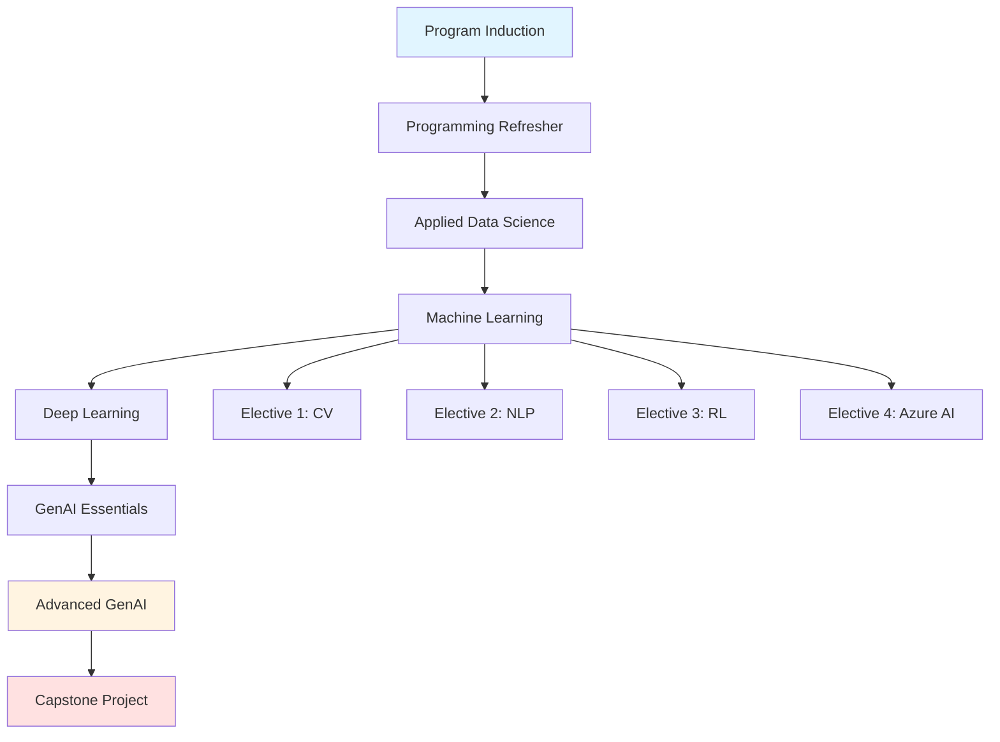

# IITK AIML - Generative AI and Machine Learning Certificate Program

## Program Overview

This comprehensive certificate course from IIT Kanpur provides an immersive learning experience covering every facet of generative AI and machine learning. The program is designed to build a strong foundation for launching a career in AI/ML with hands-on projects, industry-relevant skills, and academic masterclasses from IIT Kanpur faculty.

---

## Core Curriculum

### 1. Program Induction
- Introduction to the program structure and learning methodology
- Overview of generative AI and machine learning landscape
- Career pathways and industry applications

### 2. Programming Refresher
**Python Fundamentals:**
- Installation of Python and IDE setup
- Mastery in utilizing Jupyter Notebook
- Implementation of identifiers, indentations, and comments
- Identification of Python data types and operators
- Understanding different types of Python loops
- Exploration of variable scope within functions

### 3. Applied Data Science with Python

**Data Science Foundations:**
- Introduction to data science and its practical applications
- Grasp the essentials of NumPy
- Investigation into array indexing and slicing techniques
- Application of linear algebra principles in data analysis

**Statistical Analysis:**
- Calculation of central tendency and dispersion measures
- Explanation of null and alternative hypotheses
- Exploration of various hypothesis testing methods including Z-test and T-test
- Understanding the concept of ANOVA (Analysis of Variance)

**Data Manipulation & Visualization:**
- Utilization of Pandas for data loading, indexing, reindexing, and merging
- Data preparation, formatting, normalization, and standardization through data binning
- Creation of graphical representations using:
  - Matplotlib
  - Seaborn
  - Plotly
  - Bokeh

### 4. Machine Learning

**Core ML Concepts:**
- Investigate the machine learning pipeline
- Learn about supervised learning and its applications
- Understand methods to identify and prevent overfitting and underfitting
- Visualize variable linearity using correlation maps

**Algorithms & Techniques:**
- Explore classification algorithms and their practical usage
- Master various unsupervised learning techniques
- Recognize suitable scenarios for unsupervised algorithms and types of clustering
- Develop a recommendation engine using PyTorch

### 5. Deep Learning with Keras and TensorFlow

**Neural Networks Fundamentals:**
- Differentiate between deep learning and machine learning
- Understand neural networks, including forward and backward propagation
- Utilize TensorFlow 2 and Keras for model development
- Enhance model performance and interpret results effectively

**Advanced Architectures:**
- Explore convolutional neural networks (CNNs) and transfer learning for object detection
- Learn about recurrent neural networks (RNNs) and autoencoders

### 6. Essentials of GenAI, Prompt Engineering & ChatGPT

**Cutting-Edge Knowledge:**
- Explore generative AI, prompt engineering, and ChatGPT
- Hands-on skills: Gain practical insights into real-world business applications
- Effective GenAI utilization: Learn to apply Generative AI effectively in various scenarios
- Master prompt engineering: Understand its importance in crafting customized outputs

### 7. Advanced Generative AI

**Generative AI Architectures:**
- Transformers' significance in modern AI
- Neural networks' suitability for generative tasks
- Differentiate generative model types:
  - VAEs (Variational Autoencoders)
  - GANs (Generative Adversarial Networks)
  - Transformers
  - Autoencoders

**Advanced Techniques:**
- Appropriate scenarios for diverse generative AI models
- Assess attention mechanisms' efficacy in generative tasks
- Analyze GPT and BERT, contrasting their architectural goals in generative AI

**LLM Development & Deployment:**
- Langchain and Workflow Design
- Advanced Prompt Engineering Techniques
- LLM Application Development
- LLM Fine-Tuning and Customization
- Benchmarking and Evaluation of LLM Capabilities

---

## Capstone Project

At the end of the Machine Learning course, participants embark on a **capstone project** to apply their newfound skills in real-world scenarios:

- Tackle real industry challenges with mentor guidance
- Demonstrate practical application of learned concepts
- Showcase abilities to potential employers
- Build portfolio-ready projects

---

## Elective Courses

### 1. ADL & Computer Vision
Advanced Deep Learning techniques focused on computer vision applications

### 2. NLP and Speech Recognition
Natural Language Processing and speech recognition technologies

### 3. Reinforcement Learning
**Learning Outcomes:**
- Learn foundational principles of reinforcement learning (RL)
- Explore various RL approaches using Python and TensorFlow
- Apply RL techniques and algorithms for problem-solving
- Gain practical experience in tackling RL challenges

### 4. Microsoft Azure AI Fundamentals
Cloud-based AI services and Azure AI platform fundamentals

---

## Academic Masterclass by IIT Kanpur

**Interactive Learning Sessions:**
- Engage in enlightening online interactive masterclasses
- Led by distinguished faculty members from IIT Kanpur
- Invaluable insights into the latest advancements in technology

**Topics Covered:**
- Data Science
- Artificial Intelligence (AI)
- Generative AI (GenAI)
- Machine Learning
- Comprehensive discussions and presentations on cutting-edge techniques

---

## Program Highlights

✅ **Comprehensive Curriculum** - From Python basics to advanced GenAI  
✅ **Hands-On Learning** - Practical projects and real-world applications  
✅ **Industry-Relevant Skills** - LLM development, fine-tuning, and deployment  
✅ **Expert Faculty** - Learn from IIT Kanpur professors  
✅ **Capstone Project** - Build portfolio-worthy projects with mentor guidance  
✅ **Flexible Electives** - Choose specializations aligned with career goals  
✅ **Certificate** - IIT Kanpur certification upon completion  

---

## Learning Path

---

## Technologies & Tools Covered

| Category | Tools & Frameworks |
|----------|-------------------|
| **Programming** | Python, Jupyter Notebook |
| **Data Science** | NumPy, Pandas, Matplotlib, Seaborn, Plotly, Bokeh |
| **Machine Learning** | Scikit-learn, PyTorch |
| **Deep Learning** | TensorFlow 2, Keras |
| **GenAI** | ChatGPT, Langchain, GPT, BERT |
| **Cloud** | Microsoft Azure AI |
| **Reinforcement Learning** | Python RL libraries, TensorFlow |

---

## Target Audience

This program is ideal for:
- Aspiring AI/ML professionals
- Data scientists looking to upskill in GenAI
- Software engineers transitioning to AI roles
- Professionals seeking IIT Kanpur certification
- Anyone interested in cutting-edge generative AI technologies

---

*Last Updated: January 2026*
